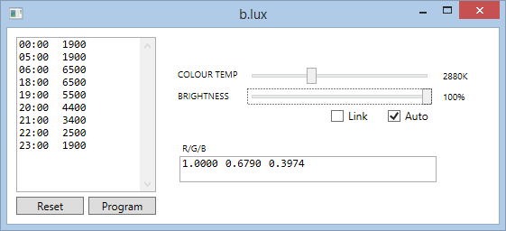

blux
====

b.lux is a very basic Windows program which changes the colour temperature of the display.

It is inspired by the fantasic [f.lux](https://justgetflux.com/), with a couple of differences:

First, unlike f.lux, the colour temperature changes are based on the *time of day* rather than the time of sunset. It may be dark outside at 4pm in winter, but I won't be going to bed until much later, so I don't want my display to turn orange in the mid-afternoon!

Secondly, the rate of colour temperature change is *very gradual*, taking place over a period of several hours. The theory is, the less perceptable the change, the greater likelihood of the user allowing it to take place (not closing the program or choosing "disable for an hour" etc).

There is a schedule to set how the colour temperature should change during the day. By default, daytime hours are 6am - 6pm:

* 6am - 6pm: Default colour temperature of 6500K
* 6pm - 9pm: Colour temperature will gradually change to 3400K
* 9pm - 11pm: Colour temperature will gradually change to 1900K

This can be changed by editing the textbox and clicking 'Program'. The default program can be restored by clicking 'Reset'.

The UI also allows for brightness adjustment. This can be useful on desktop PCs, which unlike laptops don't have hotkeys to control brightness.

